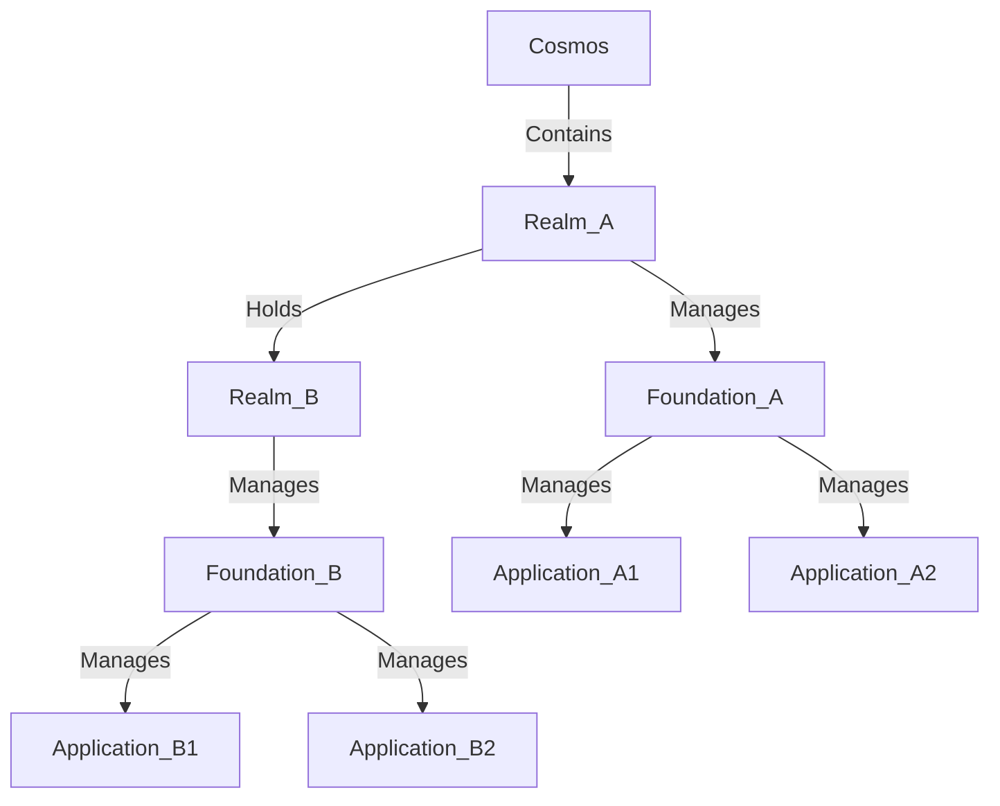

# XIA Cosmos Template
## Introduction
1. Cosmos is the root component
2. Realm represents a directory-like component holds Foundation as file-like objects
3. Foundation represents a socle on which application should run on

## Quick Start
Let's using Github + GCP as an example
### Prerequisites
* Need having an available GCP Account and GitHub Account
* Using GCP Web Console or a PC with `gh`, `gcloud` and `terraform` installed.
This quick start is based on GCP Web console. 

### Steps
1. Running `gh auth login -s delete_repo` to get GitHub authenticated in Web Console
2. Running `gh repo create <your-new-repo-name> --template x-i-a/template-repo-name>

## Organizational

## Usage
### Bigbang
Bigbang is the beginning of the initialization which creates the terraform backend.
`make bigbang topology=<topology> params="<key>:<value> <key>:<value>"'`

### Initialization of modules
Initialization of the module to be used in cosmos
`make init-module module_uri=<package_name>@<version>/<module_name>"`

### Activation of modules
Activation of the module to be used in foundation
`make init-module module_uri=<package_name>@<version>/<module_name>"`
