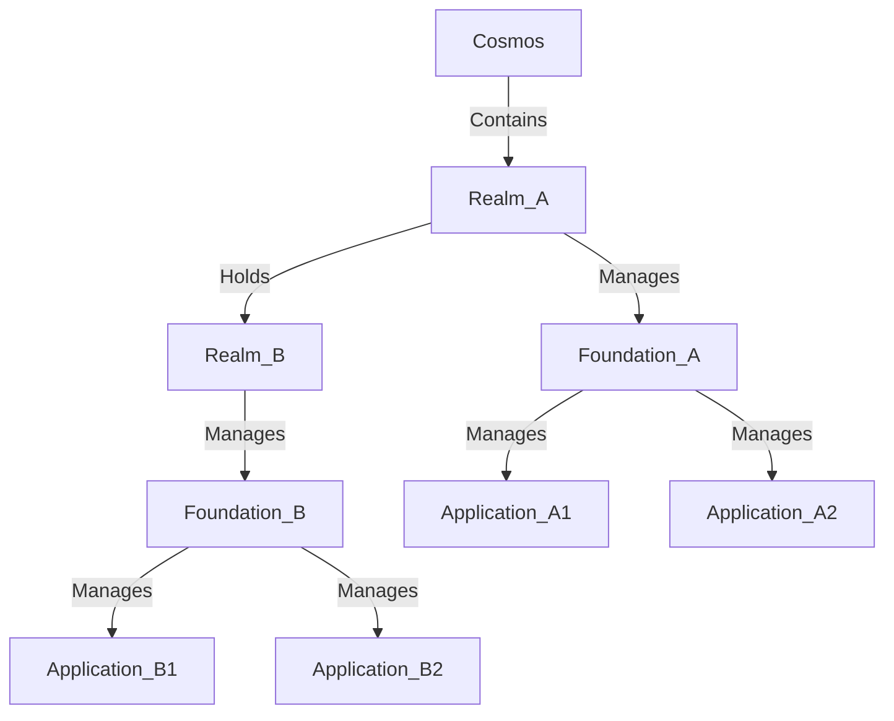

# XIA Cosmos Template
## Introduction
1. Cosmos is the root component
2. Realm represents a directory-like component holds Foundation as file-like objects
3. Foundation represents a socle on which application should run on


## Quick Start
Let's using Github + GCP as an example
### Prerequisites
* Need having an available GCP Account and GitHub Account
* Using GCP Web Console or a PC with `gh`, `gcloud` and `terraform` installed.
This quick start is based on GCP Web console. 

### Configuration Steps
1. Running `gh auth login -s delete_repo` to get GitHub authenticated in Web Console
2. Running `read -p "Please enter the cosmos_name: " COSMOS_NAME; echo "You entered: $COSMOS_NAME as cosmos name" && export COSMOS_NAME=$COSMOS_NAME` to choose cosmos name
3. Running `gh repo create $COSMOS_NAME --public --template x-i-a/xia-template-cosmos` to create the cosmos project
4. Running `gh repo clone $COSMOS_NAME && cd $COSMOS_NAME` to clone the cosmos repository
5. Running `make bigbang` to create the cosmos
6. Running `make init-config` to initialize the configuration files
7. modifying `config/landscape.yaml` file to reflect desired cosmos structure
8. we decided to also use gcs to save foundation's state files and the cosmos should use gcp resources
    ```
    make init-module module_uri=xia-module-terraform-gcs/module-foundation-backend-gcs
    make init-module module_uri=xia-module-terraform-gcs/module-foundation-state-gcs
    make init-module module_uri=xia-module-gcp-project/gcp-module-organization
    ```
9. Running `make init-config` to initialize the recent added configuration files
10. adapting `config/core/foundation_tfstate.yaml` to configure where to hold the state file of foundations
11. Running `make apply` to apply initialization 

## Organizational

## Usage
### Bigbang
Bigbang is the beginning of the initialization which creates the terraform backend.
`make bigbang topology=<topology> params="<key>:<value> <key>:<value>"'`

### Initialization of modules
Initialization of the module to be used in cosmos
`make init-module module_uri=<package_name>@<version>/<module_name>"`

### Activation of modules
Activation of the module to be used in foundation
`make init-module module_uri=<package_name>@<version>/<module_name>"`
